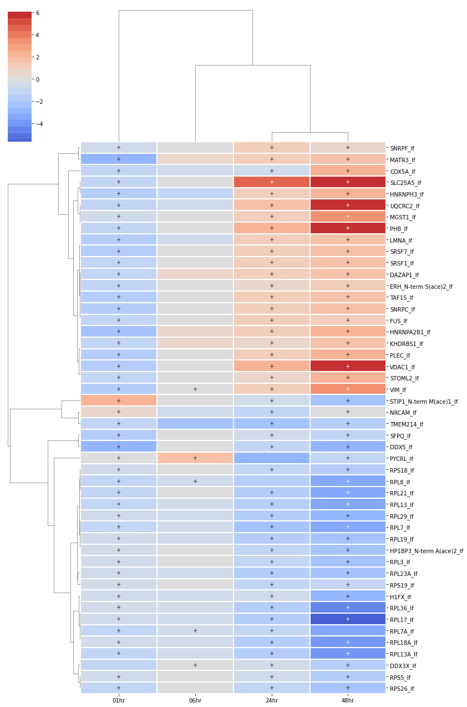

Tutorial
========

.. code:: ipython3

    from IPython.display import display, Image
    %matplotlib inline
    import matplotlib.pyplot as plt

.. code:: ipython3

    import pandas as pd
    import seaborn as sns
    import numpy as np

ExperimentalData
----------------

Since MAGINE is built for multi-sample, multi-omics data, it is no
surprise that the data is the most important aspect. Here we should how
to use the ``ExperimentalData`` class. We designed MAGINE data input to
be as flexible as possible, requiring a standard format for 8 columns.
Users are required to format the input files to share the same column
names. Additional columns can still be used for additional tags on the
data.

+-----------------------+-----------------------+-----------------------+
| Column                | Data type             | Description           |
+=======================+=======================+=======================+
| identifier            | string                | HNGC or HMDB ids      |
+-----------------------+-----------------------+-----------------------+
| label                 | string                | any label that you    |
|                       |                       | would like to have as |
|                       |                       | an alterative to      |
|                       |                       | identifier. Useful    |
|                       |                       | for PTMS              |
|                       |                       | (BAX_S(ph)292),       |
|                       |                       | aliases, or chemical  |
|                       |                       | names (Deoxyuridine)  |
+-----------------------+-----------------------+-----------------------+
| species_type          | string                | Options (gene,        |
|                       |                       | protein, or           |
|                       |                       | metabolite) Right now |
|                       |                       | we are trying to work |
|                       |                       | out a more            |
|                       |                       | comprehensive tag to  |
|                       |                       | use. For now, we      |
|                       |                       | suggest using         |
|                       |                       | ``protein`` for all   |
|                       |                       | gene related products |
|                       |                       | and use the source    |
|                       |                       | column to further     |
|                       |                       | distinguish.          |
+-----------------------+-----------------------+-----------------------+
| significant           | bool                  | used to label if the  |
|                       |                       | measurment was        |
|                       |                       | signficant compared   |
|                       |                       | to control.           |
+-----------------------+-----------------------+-----------------------+
| fold_change           | float                 | Assumes non-log space |
+-----------------------+-----------------------+-----------------------+
| p_value               | float                 | HNGC or HMDB ids      |
+-----------------------+-----------------------+-----------------------+
| identifier            | string                | Significance          |
|                       |                       | statistic for fold    |
|                       |                       | change calculation    |
|                       |                       | (can be FDR, BH, etc  |
|                       |                       | corrected.            |
+-----------------------+-----------------------+-----------------------+
| source                | string                | Experimental platform |
|                       |                       | (ie SILAC, PH_SILAC,  |
|                       |                       | LABEL_FREE, RNASEQ)   |
+-----------------------+-----------------------+-----------------------+
| sample_id             | string                | Used to identify      |
|                       |                       | sample (time points,  |
|                       |                       | drug dose, etc)       |
+-----------------------+-----------------------+-----------------------+

For this tutorial, we are going to use our time series multi-omic
response of A549 cells to cisplatin.

The description of the experiments and dataset can be found in `Norris,
Jeremy L., et
al. <https://pubs.acs.org/doi/abs/10.1021/acs.jproteome.6b01004>`__

This file is in the format as show above in the table.

.. code:: ipython3

    # load the experimental data
    from magine.data.experimental_data import load_data
    
    exp_data = load_data('Data/norris_et_al_2017_cisplatin_data.csv.gz', low_memory=False)

About the data
~~~~~~~~~~~~~~

This dataset consists of 6 experimental platforms across 4 time points.
The ExperimentData class is designed to explore these data in a seamless
way. The core of the class is a pandas.DataFrame, however we built
additional functions that we frequently used. We store meta data, such
as the ``sample_ids``, ``exp_methods``.

.. code:: ipython3

    exp_data.sample_ids

.. parsed-literal::

    ['01hr', '06hr', '24hr', '48hr']

.. code:: ipython3

    exp_data.exp_methods

.. parsed-literal::

    ['rna_seq', 'ph_silac', 'label_free', 'silac', 'C18', 'HILIC']

There are many functions built around the ExperimentalData class. This
notebook is meant to demostrate an examples workflow of how they can be
used. Please refer to the documentation for exhuastive information about
the functions.

Summary of data
~~~~~~~~~~~~~~~

Gather number of measured species per time point and platform.

.. code:: ipython3

    exp_data.create_summary_table()

.. raw:: html

    

    
    <table border="1" class="dataframe">
      <thead>
        <tr style="text-align: right;">
          <th>sample_id</th>
          <th>01hr</th>
          <th>06hr</th>
          <th>24hr</th>
          <th>48hr</th>
          <th>Total Unique Across</th>
        </tr>
        <tr>
          <th>source</th>
          <th></th>
          <th></th>
          <th></th>
          <th></th>
          <th></th>
        </tr>
      </thead>
      <tbody>
        <tr>
          <th>C18</th>
          <td>522</td>
          <td>227</td>
          <td>653</td>
          <td>685</td>
          <td>1402</td>
        </tr>
        <tr>
          <th>HILIC</th>
          <td>471</td>
          <td>605</td>
          <td>930</td>
          <td>613</td>
          <td>1504</td>
        </tr>
        <tr>
          <th>label_free</th>
          <td>2766</td>
          <td>2742</td>
          <td>2551</td>
          <td>2261</td>
          <td>3447</td>
        </tr>
        <tr>
          <th>ph_silac</th>
          <td>2608</td>
          <td>3298</td>
          <td>3384</td>
          <td>3236</td>
          <td>5113</td>
        </tr>
        <tr>
          <th>rna_seq</th>
          <td>18741</td>
          <td>19104</td>
          <td>19992</td>
          <td>-</td>
          <td>20642</td>
        </tr>
        <tr>
          <th>silac</th>
          <td>2923</td>
          <td>3357</td>
          <td>3072</td>
          <td>3265</td>
          <td>4086</td>
        </tr>
      </tbody>
    </table>
    

Count number of significantly changed (signficant_flag=True).

.. code:: ipython3

    exp_data.create_summary_table(sig=True)

.. raw:: html

    

    
    <table border="1" class="dataframe">
      <thead>
        <tr style="text-align: right;">
          <th>sample_id</th>
          <th>01hr</th>
          <th>06hr</th>
          <th>24hr</th>
          <th>48hr</th>
          <th>Total Unique Across</th>
        </tr>
        <tr>
          <th>source</th>
          <th></th>
          <th></th>
          <th></th>
          <th></th>
          <th></th>
        </tr>
      </thead>
      <tbody>
        <tr>
          <th>C18</th>
          <td>522</td>
          <td>227</td>
          <td>653</td>
          <td>685</td>
          <td>1402</td>
        </tr>
        <tr>
          <th>HILIC</th>
          <td>471</td>
          <td>605</td>
          <td>930</td>
          <td>613</td>
          <td>1504</td>
        </tr>
        <tr>
          <th>label_free</th>
          <td>196</td>
          <td>46</td>
          <td>271</td>
          <td>874</td>
          <td>1085</td>
        </tr>
        <tr>
          <th>ph_silac</th>
          <td>514</td>
          <td>888</td>
          <td>1227</td>
          <td>851</td>
          <td>2278</td>
        </tr>
        <tr>
          <th>rna_seq</th>
          <td>73</td>
          <td>1999</td>
          <td>12215</td>
          <td>-</td>
          <td>12340</td>
        </tr>
        <tr>
          <th>silac</th>
          <td>38</td>
          <td>52</td>
          <td>228</td>
          <td>266</td>
          <td>485</td>
        </tr>
      </tbody>
    </table>
    

MAGINE uses the ``identifier`` column as the default index. This keeps
things simple when using the output for other tools (passing to
molecular networks). You can also pass an index argument to calculate
other values. Here, we use the ``label`` column, which contains PTMs of
our protein species. See how ``rna_seq`` values do not change, but there
is an increase number of ``ph_silac`` unique species.

.. code:: ipython3

    exp_data.create_summary_table(sig=True, index='label')

.. raw:: html

    

    
    <table border="1" class="dataframe">
      <thead>
        <tr style="text-align: right;">
          <th>sample_id</th>
          <th>01hr</th>
          <th>06hr</th>
          <th>24hr</th>
          <th>48hr</th>
          <th>Total Unique Across</th>
        </tr>
        <tr>
          <th>source</th>
          <th></th>
          <th></th>
          <th></th>
          <th></th>
          <th></th>
        </tr>
      </thead>
      <tbody>
        <tr>
          <th>C18</th>
          <td>528</td>
          <td>227</td>
          <td>657</td>
          <td>689</td>
          <td>1412</td>
        </tr>
        <tr>
          <th>HILIC</th>
          <td>479</td>
          <td>611</td>
          <td>941</td>
          <td>621</td>
          <td>1521</td>
        </tr>
        <tr>
          <th>label_free</th>
          <td>201</td>
          <td>46</td>
          <td>281</td>
          <td>911</td>
          <td>1149</td>
        </tr>
        <tr>
          <th>ph_silac</th>
          <td>594</td>
          <td>1370</td>
          <td>2414</td>
          <td>1368</td>
          <td>4757</td>
        </tr>
        <tr>
          <th>rna_seq</th>
          <td>73</td>
          <td>1999</td>
          <td>12215</td>
          <td>-</td>
          <td>12340</td>
        </tr>
        <tr>
          <th>silac</th>
          <td>38</td>
          <td>52</td>
          <td>228</td>
          <td>266</td>
          <td>485</td>
        </tr>
      </tbody>
    </table>
    

Filter by category (experimental method)
~~~~~~~~~~~~~~~~~~~~~~~~~~~~~~~~~~~~~~~~

We can access the input data using the ``.species`` property. This
returns a modified pandas.Datatable.

.. code:: ipython3

    exp_data.species.head(5)

.. raw:: html

    

    
    <table border="1" class="dataframe">
      <thead>
        <tr style="text-align: right;">
          <th></th>
          <th>identifier</th>
          <th>label</th>
          <th>species_type</th>
          <th>fold_change</th>
          <th>p_value</th>
          <th>significant</th>
          <th>sample_id</th>
          <th>source</th>
        </tr>
      </thead>
      <tbody>
        <tr>
          <th>0</th>
          <td>HOXD1</td>
          <td>HOXD1_rnaseq</td>
          <td>protein</td>
          <td>-520.256762</td>
          <td>0.00102</td>
          <td>True</td>
          <td>06hr</td>
          <td>rna_seq</td>
        </tr>
        <tr>
          <th>1</th>
          <td>MIR7704</td>
          <td>MIR7704_rnaseq</td>
          <td>protein</td>
          <td>-520.256762</td>
          <td>0.00102</td>
          <td>True</td>
          <td>06hr</td>
          <td>rna_seq</td>
        </tr>
        <tr>
          <th>2</th>
          <td>AC078814.1</td>
          <td>AC078814.1_rnaseq</td>
          <td>protein</td>
          <td>-76.022260</td>
          <td>0.00102</td>
          <td>True</td>
          <td>06hr</td>
          <td>rna_seq</td>
        </tr>
        <tr>
          <th>3</th>
          <td>PPM1H</td>
          <td>PPM1H_rnaseq</td>
          <td>protein</td>
          <td>-76.022260</td>
          <td>0.00102</td>
          <td>True</td>
          <td>06hr</td>
          <td>rna_seq</td>
        </tr>
        <tr>
          <th>4</th>
          <td>PLCH1</td>
          <td>PLCH1_rnaseq</td>
          <td>protein</td>
          <td>-17.888990</td>
          <td>0.00102</td>
          <td>True</td>
          <td>06hr</td>
          <td>rna_seq</td>
        </tr>
      </tbody>
    </table>
    

We added attributes to the classs to quickly separate the data based on
various input columns. We use the ``species_type`` and ``source`` column
name to split data into ``compounds``, ``genes`` (includes
``species_type``\ ==\ ``gene``), ``rna`` (includes
``species_type``\ ==\ ``protein``, ``source`` == ``rna``), or
``protein`` (``species_type``\ ==\ ``gene``, ``source`` != ``rna``).
They can be accessed with the “.prefix”, such as

.. code:: ipython3

    exp_data.genes.head(5)

.. raw:: html

    

    
    <table border="1" class="dataframe">
      <thead>
        <tr style="text-align: right;">
          <th></th>
          <th>identifier</th>
          <th>label</th>
          <th>species_type</th>
          <th>fold_change</th>
          <th>p_value</th>
          <th>significant</th>
          <th>sample_id</th>
          <th>source</th>
        </tr>
      </thead>
      <tbody>
        <tr>
          <th>0</th>
          <td>HOXD1</td>
          <td>HOXD1_rnaseq</td>
          <td>protein</td>
          <td>-520.256762</td>
          <td>0.00102</td>
          <td>True</td>
          <td>06hr</td>
          <td>rna_seq</td>
        </tr>
        <tr>
          <th>1</th>
          <td>MIR7704</td>
          <td>MIR7704_rnaseq</td>
          <td>protein</td>
          <td>-520.256762</td>
          <td>0.00102</td>
          <td>True</td>
          <td>06hr</td>
          <td>rna_seq</td>
        </tr>
        <tr>
          <th>2</th>
          <td>AC078814.1</td>
          <td>AC078814.1_rnaseq</td>
          <td>protein</td>
          <td>-76.022260</td>
          <td>0.00102</td>
          <td>True</td>
          <td>06hr</td>
          <td>rna_seq</td>
        </tr>
        <tr>
          <th>3</th>
          <td>PPM1H</td>
          <td>PPM1H_rnaseq</td>
          <td>protein</td>
          <td>-76.022260</td>
          <td>0.00102</td>
          <td>True</td>
          <td>06hr</td>
          <td>rna_seq</td>
        </tr>
        <tr>
          <th>4</th>
          <td>PLCH1</td>
          <td>PLCH1_rnaseq</td>
          <td>protein</td>
          <td>-17.888990</td>
          <td>0.00102</td>
          <td>True</td>
          <td>06hr</td>
          <td>rna_seq</td>
        </tr>
      </tbody>
    </table>
    

.. code:: ipython3

    exp_data.compounds.head(5)

.. raw:: html

    

    
    <table border="1" class="dataframe">
      <thead>
        <tr style="text-align: right;">
          <th></th>
          <th>identifier</th>
          <th>label</th>
          <th>species_type</th>
          <th>fold_change</th>
          <th>p_value</th>
          <th>significant</th>
          <th>sample_id</th>
          <th>source</th>
        </tr>
      </thead>
      <tbody>
        <tr>
          <th>128152</th>
          <td>HMDB0036114</td>
          <td>(-)-3-Thujone</td>
          <td>metabolites</td>
          <td>1.6</td>
          <td>2.100000e-02</td>
          <td>True</td>
          <td>06hr</td>
          <td>C18</td>
        </tr>
        <tr>
          <th>128153</th>
          <td>HMDB0001320</td>
          <td>(13E)-11a-Hydroxy-9,15-dioxoprost-13-enoic acid</td>
          <td>metabolites</td>
          <td>88.8</td>
          <td>5.800000e-12</td>
          <td>True</td>
          <td>24hr</td>
          <td>C18</td>
        </tr>
        <tr>
          <th>128154</th>
          <td>HMDB0012113</td>
          <td>(22Alpha)-hydroxy-campest-4-en-3-one</td>
          <td>metabolites</td>
          <td>100.0</td>
          <td>9.500000e-04</td>
          <td>True</td>
          <td>48hr</td>
          <td>HILIC</td>
        </tr>
        <tr>
          <th>128155</th>
          <td>HMDB0010361</td>
          <td>(23S)-23,25-dihdroxy-24-oxovitamine D3 23-(bet...</td>
          <td>metabolites</td>
          <td>-100.0</td>
          <td>1.000000e-12</td>
          <td>True</td>
          <td>48hr</td>
          <td>C18</td>
        </tr>
        <tr>
          <th>128156</th>
          <td>HMDB0011644</td>
          <td>(24R)-Cholest-5-ene-3-beta,7-alpha,24-triol</td>
          <td>metabolites</td>
          <td>1.6</td>
          <td>7.400000e-05</td>
          <td>True</td>
          <td>01hr</td>
          <td>C18</td>
        </tr>
      </tbody>
    </table>
    

Similarily, we can also filter the data by ``source`` using the
``.name``, where name is anything in the ``source`` column. We can get a
list of these by printing ``exp_data.exp_methods``.

.. code:: ipython3

    # prints all the available exp_methods
    exp_data.exp_methods

.. parsed-literal::

    ['rna_seq', 'ph_silac', 'label_free', 'silac', 'C18', 'HILIC']

.. code:: ipython3

    # filters to only the 'label_free' 
    exp_data.label_free.shape

.. parsed-literal::

    (13085, 8)

.. code:: ipython3

    exp_data.label_free.head(5)

.. raw:: html

    

    
    <table border="1" class="dataframe">
      <thead>
        <tr style="text-align: right;">
          <th></th>
          <th>identifier</th>
          <th>label</th>
          <th>species_type</th>
          <th>fold_change</th>
          <th>p_value</th>
          <th>significant</th>
          <th>sample_id</th>
          <th>source</th>
        </tr>
      </thead>
      <tbody>
        <tr>
          <th>102446</th>
          <td>LIMS1</td>
          <td>LIMS1_lf</td>
          <td>protein</td>
          <td>12.42</td>
          <td>0.00003</td>
          <td>True</td>
          <td>01hr</td>
          <td>label_free</td>
        </tr>
        <tr>
          <th>102447</th>
          <td>SMARCE1</td>
          <td>SMARCE1_lf</td>
          <td>protein</td>
          <td>-2.49</td>
          <td>0.00030</td>
          <td>True</td>
          <td>01hr</td>
          <td>label_free</td>
        </tr>
        <tr>
          <th>102448</th>
          <td>HEXA</td>
          <td>HEXA_lf</td>
          <td>protein</td>
          <td>6.42</td>
          <td>0.00060</td>
          <td>True</td>
          <td>01hr</td>
          <td>label_free</td>
        </tr>
        <tr>
          <th>102449</th>
          <td>SRSF1</td>
          <td>SRSF1_lf</td>
          <td>protein</td>
          <td>-3.21</td>
          <td>0.00060</td>
          <td>True</td>
          <td>01hr</td>
          <td>label_free</td>
        </tr>
        <tr>
          <th>102450</th>
          <td>SF3B1</td>
          <td>SF3B1_lf</td>
          <td>protein</td>
          <td>-1.57</td>
          <td>0.00130</td>
          <td>True</td>
          <td>01hr</td>
          <td>label_free</td>
        </tr>
      </tbody>
    </table>
    

.. code:: ipython3

    exp_data.HILIC.head(5)

.. raw:: html

    

    
    <table border="1" class="dataframe">
      <thead>
        <tr style="text-align: right;">
          <th></th>
          <th>identifier</th>
          <th>label</th>
          <th>species_type</th>
          <th>fold_change</th>
          <th>p_value</th>
          <th>significant</th>
          <th>sample_id</th>
          <th>source</th>
        </tr>
      </thead>
      <tbody>
        <tr>
          <th>128154</th>
          <td>HMDB0012113</td>
          <td>(22Alpha)-hydroxy-campest-4-en-3-one</td>
          <td>metabolites</td>
          <td>100.0</td>
          <td>0.000950</td>
          <td>True</td>
          <td>48hr</td>
          <td>HILIC</td>
        </tr>
        <tr>
          <th>128157</th>
          <td>HMDB0011644</td>
          <td>(24R)-Cholest-5-ene-3-beta,7-alpha,24-triol</td>
          <td>metabolites</td>
          <td>1.7</td>
          <td>0.000072</td>
          <td>True</td>
          <td>24hr</td>
          <td>HILIC</td>
        </tr>
        <tr>
          <th>128162</th>
          <td>HMDB0012114</td>
          <td>(3S)-3,6-Diaminohexanoate</td>
          <td>metabolites</td>
          <td>-1.9</td>
          <td>0.000030</td>
          <td>True</td>
          <td>06hr</td>
          <td>HILIC</td>
        </tr>
        <tr>
          <th>128164</th>
          <td>HMDB0012114</td>
          <td>(3S)-3,6-Diaminohexanoate</td>
          <td>metabolites</td>
          <td>-3.0</td>
          <td>0.002000</td>
          <td>True</td>
          <td>24hr</td>
          <td>HILIC</td>
        </tr>
        <tr>
          <th>128166</th>
          <td>HMDB0012115</td>
          <td>(3S,5S)-3,5-Diaminohexanoate</td>
          <td>metabolites</td>
          <td>-1.9</td>
          <td>0.000030</td>
          <td>True</td>
          <td>06hr</td>
          <td>HILIC</td>
        </tr>
      </tbody>
    </table>
    

Significant filter
~~~~~~~~~~~~~~~~~~

We can use the ``significant`` column to filter that data to only
contain those species by applying ``.sig`` .

.. code:: ipython3

    exp_data.species.shape

.. parsed-literal::

    (132932, 8)

.. code:: ipython3

    exp_data.species.sig.shape

.. parsed-literal::

    (27288, 8)

.. code:: ipython3

    exp_data.label_free.sig.head(5)

.. raw:: html

    

    
    <table border="1" class="dataframe">
      <thead>
        <tr style="text-align: right;">
          <th></th>
          <th>identifier</th>
          <th>label</th>
          <th>species_type</th>
          <th>fold_change</th>
          <th>p_value</th>
          <th>significant</th>
          <th>sample_id</th>
          <th>source</th>
        </tr>
      </thead>
      <tbody>
        <tr>
          <th>102446</th>
          <td>LIMS1</td>
          <td>LIMS1_lf</td>
          <td>protein</td>
          <td>12.42</td>
          <td>0.00003</td>
          <td>True</td>
          <td>01hr</td>
          <td>label_free</td>
        </tr>
        <tr>
          <th>102447</th>
          <td>SMARCE1</td>
          <td>SMARCE1_lf</td>
          <td>protein</td>
          <td>-2.49</td>
          <td>0.00030</td>
          <td>True</td>
          <td>01hr</td>
          <td>label_free</td>
        </tr>
        <tr>
          <th>102448</th>
          <td>HEXA</td>
          <td>HEXA_lf</td>
          <td>protein</td>
          <td>6.42</td>
          <td>0.00060</td>
          <td>True</td>
          <td>01hr</td>
          <td>label_free</td>
        </tr>
        <tr>
          <th>102449</th>
          <td>SRSF1</td>
          <td>SRSF1_lf</td>
          <td>protein</td>
          <td>-3.21</td>
          <td>0.00060</td>
          <td>True</td>
          <td>01hr</td>
          <td>label_free</td>
        </tr>
        <tr>
          <th>102450</th>
          <td>SF3B1</td>
          <td>SF3B1_lf</td>
          <td>protein</td>
          <td>-1.57</td>
          <td>0.00130</td>
          <td>True</td>
          <td>01hr</td>
          <td>label_free</td>
        </tr>
      </tbody>
    </table>
    

Filter data to up or down regulated species.
~~~~~~~~~~~~~~~~~~~~~~~~~~~~~~~~~~~~~~~~~~~~

For enrichment analysis, we will want to access up-regulated and
down-regulated species using ``.up`` and ``.down``.

.. code:: ipython3

    exp_data.label_free.up.head(5)

.. raw:: html

    

    
    <table border="1" class="dataframe">
      <thead>
        <tr style="text-align: right;">
          <th></th>
          <th>identifier</th>
          <th>label</th>
          <th>species_type</th>
          <th>fold_change</th>
          <th>p_value</th>
          <th>significant</th>
          <th>sample_id</th>
          <th>source</th>
        </tr>
      </thead>
      <tbody>
        <tr>
          <th>102446</th>
          <td>LIMS1</td>
          <td>LIMS1_lf</td>
          <td>protein</td>
          <td>12.42</td>
          <td>0.00003</td>
          <td>True</td>
          <td>01hr</td>
          <td>label_free</td>
        </tr>
        <tr>
          <th>102448</th>
          <td>HEXA</td>
          <td>HEXA_lf</td>
          <td>protein</td>
          <td>6.42</td>
          <td>0.00060</td>
          <td>True</td>
          <td>01hr</td>
          <td>label_free</td>
        </tr>
        <tr>
          <th>102451</th>
          <td>USP15</td>
          <td>USP15_N-term A(ace)2_lf</td>
          <td>protein</td>
          <td>18.78</td>
          <td>0.00270</td>
          <td>True</td>
          <td>01hr</td>
          <td>label_free</td>
        </tr>
        <tr>
          <th>102460</th>
          <td>SBDS</td>
          <td>SBDS_lf</td>
          <td>protein</td>
          <td>2.79</td>
          <td>0.00560</td>
          <td>True</td>
          <td>01hr</td>
          <td>label_free</td>
        </tr>
        <tr>
          <th>102488</th>
          <td>CLIC4</td>
          <td>CLIC4_lf</td>
          <td>protein</td>
          <td>2.03</td>
          <td>0.01880</td>
          <td>True</td>
          <td>01hr</td>
          <td>label_free</td>
        </tr>
      </tbody>
    </table>
    

.. code:: ipython3

    exp_data.label_free.down.head(5)

.. raw:: html

    

    
    <table border="1" class="dataframe">
      <thead>
        <tr style="text-align: right;">
          <th></th>
          <th>identifier</th>
          <th>label</th>
          <th>species_type</th>
          <th>fold_change</th>
          <th>p_value</th>
          <th>significant</th>
          <th>sample_id</th>
          <th>source</th>
        </tr>
      </thead>
      <tbody>
        <tr>
          <th>102447</th>
          <td>SMARCE1</td>
          <td>SMARCE1_lf</td>
          <td>protein</td>
          <td>-2.49</td>
          <td>0.0003</td>
          <td>True</td>
          <td>01hr</td>
          <td>label_free</td>
        </tr>
        <tr>
          <th>102449</th>
          <td>SRSF1</td>
          <td>SRSF1_lf</td>
          <td>protein</td>
          <td>-3.21</td>
          <td>0.0006</td>
          <td>True</td>
          <td>01hr</td>
          <td>label_free</td>
        </tr>
        <tr>
          <th>102450</th>
          <td>SF3B1</td>
          <td>SF3B1_lf</td>
          <td>protein</td>
          <td>-1.57</td>
          <td>0.0013</td>
          <td>True</td>
          <td>01hr</td>
          <td>label_free</td>
        </tr>
        <tr>
          <th>102452</th>
          <td>CKAP4</td>
          <td>CKAP4_lf</td>
          <td>protein</td>
          <td>-3.26</td>
          <td>0.0030</td>
          <td>True</td>
          <td>01hr</td>
          <td>label_free</td>
        </tr>
        <tr>
          <th>102453</th>
          <td>DDX17</td>
          <td>DDX17_lf</td>
          <td>protein</td>
          <td>-3.08</td>
          <td>0.0034</td>
          <td>True</td>
          <td>01hr</td>
          <td>label_free</td>
        </tr>
      </tbody>
    </table>
    

Extracting by sample (time point)
~~~~~~~~~~~~~~~~~~~~~~~~~~~~~~~~~

We also added an index filter to segregate by ``sample_id``.

.. code:: ipython3

    for i in exp_data.sample_ids:
        print(i)
        display(exp_data[i].head(5))

.. parsed-literal::

    01hr
    

.. raw:: html

    

    
    <table border="1" class="dataframe">
      <thead>
        <tr style="text-align: right;">
          <th></th>
          <th>identifier</th>
          <th>label</th>
          <th>species_type</th>
          <th>fold_change</th>
          <th>p_value</th>
          <th>significant</th>
          <th>sample_id</th>
          <th>source</th>
        </tr>
      </thead>
      <tbody>
        <tr>
          <th>19160</th>
          <td>GRIK4</td>
          <td>GRIK4_rnaseq</td>
          <td>protein</td>
          <td>77.555651</td>
          <td>0.019824</td>
          <td>True</td>
          <td>01hr</td>
          <td>rna_seq</td>
        </tr>
        <tr>
          <th>19161</th>
          <td>GRIK4_3p_UTR</td>
          <td>GRIK4_3p_UTR_rnaseq</td>
          <td>protein</td>
          <td>77.555651</td>
          <td>0.019824</td>
          <td>True</td>
          <td>01hr</td>
          <td>rna_seq</td>
        </tr>
        <tr>
          <th>19162</th>
          <td>AP001187.9</td>
          <td>AP001187.9_rnaseq</td>
          <td>protein</td>
          <td>-25.455050</td>
          <td>0.019824</td>
          <td>True</td>
          <td>01hr</td>
          <td>rna_seq</td>
        </tr>
        <tr>
          <th>19163</th>
          <td>MIR192</td>
          <td>MIR192_rnaseq</td>
          <td>protein</td>
          <td>-25.455050</td>
          <td>0.019824</td>
          <td>True</td>
          <td>01hr</td>
          <td>rna_seq</td>
        </tr>
        <tr>
          <th>19164</th>
          <td>MIR194-2</td>
          <td>MIR194-2_rnaseq</td>
          <td>protein</td>
          <td>-25.455050</td>
          <td>0.019824</td>
          <td>True</td>
          <td>01hr</td>
          <td>rna_seq</td>
        </tr>
      </tbody>
    </table>
    

.. parsed-literal::

    06hr
    

.. raw:: html

    

    
    <table border="1" class="dataframe">
      <thead>
        <tr style="text-align: right;">
          <th></th>
          <th>identifier</th>
          <th>label</th>
          <th>species_type</th>
          <th>fold_change</th>
          <th>p_value</th>
          <th>significant</th>
          <th>sample_id</th>
          <th>source</th>
        </tr>
      </thead>
      <tbody>
        <tr>
          <th>0</th>
          <td>HOXD1</td>
          <td>HOXD1_rnaseq</td>
          <td>protein</td>
          <td>-520.256762</td>
          <td>0.00102</td>
          <td>True</td>
          <td>06hr</td>
          <td>rna_seq</td>
        </tr>
        <tr>
          <th>1</th>
          <td>MIR7704</td>
          <td>MIR7704_rnaseq</td>
          <td>protein</td>
          <td>-520.256762</td>
          <td>0.00102</td>
          <td>True</td>
          <td>06hr</td>
          <td>rna_seq</td>
        </tr>
        <tr>
          <th>2</th>
          <td>AC078814.1</td>
          <td>AC078814.1_rnaseq</td>
          <td>protein</td>
          <td>-76.022260</td>
          <td>0.00102</td>
          <td>True</td>
          <td>06hr</td>
          <td>rna_seq</td>
        </tr>
        <tr>
          <th>3</th>
          <td>PPM1H</td>
          <td>PPM1H_rnaseq</td>
          <td>protein</td>
          <td>-76.022260</td>
          <td>0.00102</td>
          <td>True</td>
          <td>06hr</td>
          <td>rna_seq</td>
        </tr>
        <tr>
          <th>4</th>
          <td>PLCH1</td>
          <td>PLCH1_rnaseq</td>
          <td>protein</td>
          <td>-17.888990</td>
          <td>0.00102</td>
          <td>True</td>
          <td>06hr</td>
          <td>rna_seq</td>
        </tr>
      </tbody>
    </table>
    

.. parsed-literal::

    24hr
    

.. raw:: html

    

    
    <table border="1" class="dataframe">
      <thead>
        <tr style="text-align: right;">
          <th></th>
          <th>identifier</th>
          <th>label</th>
          <th>species_type</th>
          <th>fold_change</th>
          <th>p_value</th>
          <th>significant</th>
          <th>sample_id</th>
          <th>source</th>
        </tr>
      </thead>
      <tbody>
        <tr>
          <th>37960</th>
          <td>LHX3</td>
          <td>LHX3_rnaseq</td>
          <td>protein</td>
          <td>202.225343</td>
          <td>0.005180</td>
          <td>True</td>
          <td>24hr</td>
          <td>rna_seq</td>
        </tr>
        <tr>
          <th>37961</th>
          <td>C17orf67</td>
          <td>C17orf67_rnaseq</td>
          <td>protein</td>
          <td>2.571464</td>
          <td>0.000123</td>
          <td>True</td>
          <td>24hr</td>
          <td>rna_seq</td>
        </tr>
        <tr>
          <th>37962</th>
          <td>ALX1</td>
          <td>ALX1_rnaseq</td>
          <td>protein</td>
          <td>-2.572587</td>
          <td>0.000123</td>
          <td>True</td>
          <td>24hr</td>
          <td>rna_seq</td>
        </tr>
        <tr>
          <th>37963</th>
          <td>MIR7844</td>
          <td>MIR7844_rnaseq</td>
          <td>protein</td>
          <td>2.573033</td>
          <td>0.009349</td>
          <td>True</td>
          <td>24hr</td>
          <td>rna_seq</td>
        </tr>
        <tr>
          <th>37964</th>
          <td>TMCC3</td>
          <td>TMCC3_rnaseq</td>
          <td>protein</td>
          <td>2.573033</td>
          <td>0.009349</td>
          <td>True</td>
          <td>24hr</td>
          <td>rna_seq</td>
        </tr>
      </tbody>
    </table>
    

.. parsed-literal::

    48hr
    

.. raw:: html

    

    
    <table border="1" class="dataframe">
      <thead>
        <tr style="text-align: right;">
          <th></th>
          <th>identifier</th>
          <th>label</th>
          <th>species_type</th>
          <th>fold_change</th>
          <th>p_value</th>
          <th>significant</th>
          <th>sample_id</th>
          <th>source</th>
        </tr>
      </thead>
      <tbody>
        <tr>
          <th>58025</th>
          <td>TNS3</td>
          <td>TNS3_1188_1197_phsilac</td>
          <td>protein</td>
          <td>-3.837129</td>
          <td>0.049</td>
          <td>True</td>
          <td>48hr</td>
          <td>ph_silac</td>
        </tr>
        <tr>
          <th>58026</th>
          <td>SIPA1L3</td>
          <td>SIPA1L3_S(ph)158_phsilac</td>
          <td>protein</td>
          <td>-5.119600</td>
          <td>0.049</td>
          <td>True</td>
          <td>48hr</td>
          <td>ph_silac</td>
        </tr>
        <tr>
          <th>58027</th>
          <td>TNS3</td>
          <td>TNS3_Y(ph)780_phsilac</td>
          <td>protein</td>
          <td>-4.986421</td>
          <td>0.049</td>
          <td>True</td>
          <td>48hr</td>
          <td>ph_silac</td>
        </tr>
        <tr>
          <th>58028</th>
          <td>FGD6</td>
          <td>FGD6_S(ph)554_phsilac</td>
          <td>protein</td>
          <td>-3.900705</td>
          <td>0.049</td>
          <td>True</td>
          <td>48hr</td>
          <td>ph_silac</td>
        </tr>
        <tr>
          <th>58029</th>
          <td>GPN1</td>
          <td>GPN1_S(ph)312_phsilac</td>
          <td>protein</td>
          <td>2.901199</td>
          <td>0.049</td>
          <td>True</td>
          <td>48hr</td>
          <td>ph_silac</td>
        </tr>
      </tbody>
    </table>
    

.. code:: ipython3

    exp_data['01hr'].head(5)

.. raw:: html

    

    
    <table border="1" class="dataframe">
      <thead>
        <tr style="text-align: right;">
          <th></th>
          <th>identifier</th>
          <th>label</th>
          <th>species_type</th>
          <th>fold_change</th>
          <th>p_value</th>
          <th>significant</th>
          <th>sample_id</th>
          <th>source</th>
        </tr>
      </thead>
      <tbody>
        <tr>
          <th>19160</th>
          <td>GRIK4</td>
          <td>GRIK4_rnaseq</td>
          <td>protein</td>
          <td>77.555651</td>
          <td>0.019824</td>
          <td>True</td>
          <td>01hr</td>
          <td>rna_seq</td>
        </tr>
        <tr>
          <th>19161</th>
          <td>GRIK4_3p_UTR</td>
          <td>GRIK4_3p_UTR_rnaseq</td>
          <td>protein</td>
          <td>77.555651</td>
          <td>0.019824</td>
          <td>True</td>
          <td>01hr</td>
          <td>rna_seq</td>
        </tr>
        <tr>
          <th>19162</th>
          <td>AP001187.9</td>
          <td>AP001187.9_rnaseq</td>
          <td>protein</td>
          <td>-25.455050</td>
          <td>0.019824</td>
          <td>True</td>
          <td>01hr</td>
          <td>rna_seq</td>
        </tr>
        <tr>
          <th>19163</th>
          <td>MIR192</td>
          <td>MIR192_rnaseq</td>
          <td>protein</td>
          <td>-25.455050</td>
          <td>0.019824</td>
          <td>True</td>
          <td>01hr</td>
          <td>rna_seq</td>
        </tr>
        <tr>
          <th>19164</th>
          <td>MIR194-2</td>
          <td>MIR194-2_rnaseq</td>
          <td>protein</td>
          <td>-25.455050</td>
          <td>0.019824</td>
          <td>True</td>
          <td>01hr</td>
          <td>rna_seq</td>
        </tr>
      </tbody>
    </table>
    

Pivot table to get table across time
~~~~~~~~~~~~~~~~~~~~~~~~~~~~~~~~~~~~

We also provide a function to quickly pivot the data to for easy export.

.. code:: ipython3

    exp_data.label_free.pivoter(
        convert_to_log=False, 
        index='identifier',
        columns='sample_id',
        values=['fold_change', 'p_value']
    ).head(10)

.. raw:: html

    

    
    <table border="1" class="dataframe">
      <thead>
        <tr>
          <th></th>
          <th colspan="4" halign="left">fold_change</th>
          <th colspan="4" halign="left">p_value</th>
        </tr>
        <tr>
          <th>sample_id</th>
          <th>01hr</th>
          <th>06hr</th>
          <th>24hr</th>
          <th>48hr</th>
          <th>01hr</th>
          <th>06hr</th>
          <th>24hr</th>
          <th>48hr</th>
        </tr>
        <tr>
          <th>identifier</th>
          <th></th>
          <th></th>
          <th></th>
          <th></th>
          <th></th>
          <th></th>
          <th></th>
          <th></th>
        </tr>
      </thead>
      <tbody>
        <tr>
          <th>A2M</th>
          <td>1.040000</td>
          <td>1.140</td>
          <td>51.93</td>
          <td>11.58</td>
          <td>0.514800</td>
          <td>0.44370</td>
          <td>0.24260</td>
          <td>0.11130</td>
        </tr>
        <tr>
          <th>AACS</th>
          <td>-1.100000</td>
          <td>3.740</td>
          <td>NaN</td>
          <td>NaN</td>
          <td>0.281800</td>
          <td>0.26950</td>
          <td>NaN</td>
          <td>NaN</td>
        </tr>
        <tr>
          <th>AAGAB</th>
          <td>1.000000</td>
          <td>-1.150</td>
          <td>1.46</td>
          <td>-2.03</td>
          <td>0.968100</td>
          <td>0.39240</td>
          <td>0.84450</td>
          <td>0.09760</td>
        </tr>
        <tr>
          <th>AAK1</th>
          <td>1.320000</td>
          <td>1.590</td>
          <td>NaN</td>
          <td>1.72</td>
          <td>0.715800</td>
          <td>0.18110</td>
          <td>NaN</td>
          <td>0.95660</td>
        </tr>
        <tr>
          <th>AAMP</th>
          <td>-1.200000</td>
          <td>-1.460</td>
          <td>1.85</td>
          <td>1.78</td>
          <td>0.836800</td>
          <td>0.55420</td>
          <td>0.13640</td>
          <td>0.32460</td>
        </tr>
        <tr>
          <th>AAR2</th>
          <td>NaN</td>
          <td>-1.690</td>
          <td>NaN</td>
          <td>NaN</td>
          <td>NaN</td>
          <td>0.96510</td>
          <td>NaN</td>
          <td>NaN</td>
        </tr>
        <tr>
          <th>AARS</th>
          <td>0.326667</td>
          <td>-0.035</td>
          <td>-1.44</td>
          <td>-3.12</td>
          <td>0.299867</td>
          <td>0.62425</td>
          <td>0.46725</td>
          <td>0.00045</td>
        </tr>
        <tr>
          <th>AARS2</th>
          <td>1.170000</td>
          <td>NaN</td>
          <td>NaN</td>
          <td>NaN</td>
          <td>0.253000</td>
          <td>NaN</td>
          <td>NaN</td>
          <td>NaN</td>
        </tr>
        <tr>
          <th>AARSD1</th>
          <td>1.210000</td>
          <td>4.070</td>
          <td>-2.05</td>
          <td>NaN</td>
          <td>0.459700</td>
          <td>0.49160</td>
          <td>0.78440</td>
          <td>NaN</td>
        </tr>
        <tr>
          <th>AASDHPPT</th>
          <td>-0.330000</td>
          <td>1.020</td>
          <td>1.07</td>
          <td>-1.11</td>
          <td>0.709600</td>
          <td>0.81160</td>
          <td>0.45290</td>
          <td>0.00070</td>
        </tr>
      </tbody>
    </table>
    

Note that in the previous two examples, we find that there are NaN
values. This is because of our experiental data. We can easy check what
species are not found in all 4 of our label free experiements.

.. code:: ipython3

    print(len(exp_data.label_free.present_in_all_columns(
        index='identifier',
        columns='sample_id',
    ).id_list))

.. parsed-literal::

    Number in index went from 3447 to 1819
    1819
    

This shows that out of the 3447 unique species measured in label-free
proteomics, only 1819 were measured in all time points. What one can do
with this information is dependent on the analysis. We can filter by
requiring a species to be signficantly changed in at least ``n``
samples.

.. code:: ipython3

    print(exp_data.label_free.require_n_sig(n_sig=2).identifier.unique().shape)
    print(exp_data.label_free.require_n_sig(n_sig=3).identifier.unique().shape)
    print(exp_data.label_free.require_n_sig(n_sig=4).identifier.unique().shape)

.. parsed-literal::

    (247,)
    (53,)
    (2,)
    

It is important to note that this class is basically a hopped up
pandas.DataFrame, so the commands can be chained together.

.. code:: ipython3

    exp_data.label_free.require_n_sig(n_sig=3).pivoter(
        convert_to_log=False, 
        index='identifier',
        columns='sample_id',
        values=['fold_change', 'p_value']
    ).head(10)

.. raw:: html

    

    
    <table border="1" class="dataframe">
      <thead>
        <tr>
          <th></th>
          <th colspan="4" halign="left">fold_change</th>
          <th colspan="4" halign="left">p_value</th>
        </tr>
        <tr>
          <th>sample_id</th>
          <th>01hr</th>
          <th>06hr</th>
          <th>24hr</th>
          <th>48hr</th>
          <th>01hr</th>
          <th>06hr</th>
          <th>24hr</th>
          <th>48hr</th>
        </tr>
        <tr>
          <th>identifier</th>
          <th></th>
          <th></th>
          <th></th>
          <th></th>
          <th></th>
          <th></th>
          <th></th>
          <th></th>
        </tr>
      </thead>
      <tbody>
        <tr>
          <th>COX5A</th>
          <td>-2.185000</td>
          <td>-1.550</td>
          <td>-1.610</td>
          <td>5.480</td>
          <td>0.121850</td>
          <td>0.07850</td>
          <td>0.11900</td>
          <td>2.800000e-03</td>
        </tr>
        <tr>
          <th>DAZAP1</th>
          <td>-1.860000</td>
          <td>1.240</td>
          <td>2.040</td>
          <td>2.740</td>
          <td>0.364050</td>
          <td>0.56310</td>
          <td>0.08610</td>
          <td>1.100000e-03</td>
        </tr>
        <tr>
          <th>DDX3X</th>
          <td>-1.940000</td>
          <td>1.090</td>
          <td>-1.620</td>
          <td>-3.030</td>
          <td>0.089000</td>
          <td>0.70330</td>
          <td>0.05480</td>
          <td>2.700000e-03</td>
        </tr>
        <tr>
          <th>DDX5</th>
          <td>-7.623333</td>
          <td>1.090</td>
          <td>-2.085</td>
          <td>-6.160</td>
          <td>0.094733</td>
          <td>0.59080</td>
          <td>0.00725</td>
          <td>2.900000e-03</td>
        </tr>
        <tr>
          <th>ERH</th>
          <td>-2.340000</td>
          <td>-1.095</td>
          <td>1.440</td>
          <td>2.020</td>
          <td>0.073300</td>
          <td>0.48190</td>
          <td>0.06335</td>
          <td>1.885000e-02</td>
        </tr>
        <tr>
          <th>FUS</th>
          <td>-2.415000</td>
          <td>1.200</td>
          <td>1.940</td>
          <td>2.620</td>
          <td>0.096850</td>
          <td>0.08740</td>
          <td>0.03320</td>
          <td>6.000000e-04</td>
        </tr>
        <tr>
          <th>GPRC5A</th>
          <td>-2.450000</td>
          <td>-1.160</td>
          <td>1.800</td>
          <td>31.455</td>
          <td>0.099200</td>
          <td>0.09660</td>
          <td>0.05520</td>
          <td>4.000000e-04</td>
        </tr>
        <tr>
          <th>H1FX</th>
          <td>-1.660000</td>
          <td>-1.320</td>
          <td>-1.540</td>
          <td>-6.340</td>
          <td>0.095700</td>
          <td>0.00250</td>
          <td>0.01970</td>
          <td>9.345000e-07</td>
        </tr>
        <tr>
          <th>HNRNPA2B1</th>
          <td>-4.365000</td>
          <td>1.360</td>
          <td>2.600</td>
          <td>4.960</td>
          <td>0.050550</td>
          <td>0.09280</td>
          <td>0.05390</td>
          <td>2.000000e-04</td>
        </tr>
        <tr>
          <th>HNRNPC</th>
          <td>-4.543333</td>
          <td>4.170</td>
          <td>2.270</td>
          <td>4.920</td>
          <td>0.070000</td>
          <td>0.15085</td>
          <td>0.12120</td>
          <td>3.800000e-03</td>
        </tr>
      </tbody>
    </table>
    

Visualization
~~~~~~~~~~~~~

We provide commonly used plotting functions. ``.volcano_plot``
``.volcano_by_sample`` ``.plot_histogram`` ``.plot_species``
``.heatmap``

Volcano plots
^^^^^^^^^^^^^

.. code:: ipython3

    exp_data.label_free.volcano_plot();

.. code:: ipython3

    exp_data.label_free.volcano_by_sample(sig_column=True);

.. code:: ipython3

    exp_data.label_free.plot_histogram();

Plotting subset of species
~~~~~~~~~~~~~~~~~~~~~~~~~~

We provide the a few plotting interfaces to explore that subsets of the
data. Basically, you create a list of species and provide it to the
function. It filters based on these and then returns the results.

Time series using plot’y or matplotlib
^^^^^^^^^^^^^^^^^^^^^^^^^^^^^^^^^^^^^^

.. code:: ipython3

    exp_data.label_free.plot_species(['LMNA', 'VDAC1'], plot_type='plotly')

.. raw:: html

    
    

.. raw:: html

    
                            

                    

.. code:: ipython3

    exp_data.label_free.plot_species(['LMNA', 'VDAC1'], plot_type='matplotlib');

Heatplots
^^^^^^^^^

.. code:: ipython3

    exp_data.label_free.heatmap(
        ['LMNA', 'VDAC1'], 
        figsize=(6,4), 
        linewidths=0.01
    );

Notice that the above plot doesn’t show any of the modifiers of LMBA (no
\_s(ph)22_lf). This is because the default index to pivot plots is the
``identifier`` column. You can set the ``label`` column for plotting by
passing index=\ ``label`` to the function. Note, if you want to filter
the data using the more generic ‘identifier’ column, you just specify
that with subset_index=‘identifier’

.. code:: ipython3

    exp_data.label_free.heatmap(
        ['LMNA', 'VDAC1'], 
        subset_index='identifier', 
        index='label',
        figsize=(6,4), 
        linewidths=0.01
    );

Examples
~~~~~~~~

Here are a few examples how all the above commands can be chained
together to create plots with varying degrees of critera.

Query 1:
^^^^^^^^

::

   Heatmap of label-free proteomics that are signficantly change in at least 3 time points.

.. code:: ipython3

    lf_sig = exp_data.label_free.require_n_sig(
        index='label', 
        columns='sample_id', 
        n_sig=3
    ).heatmap(
        convert_to_log=True, 
        cluster_row=True, 
        index='label',
        values='fold_change', 
        columns='sample_id', 
        annotate_sig=True, 
        figsize=(8, 12), 
        div_colors=True,
        num_colors=21, 
        linewidths=0.01
    );

Query 2:
^^^^^^^^

::

   Changes that happen at all 3 timepoints for RNA-seq.

.. code:: ipython3

    exp_data.rna.require_n_sig(n_sig=3, index='label').plot_species(plot_type='plotly');

.. raw:: html

    
    

.. raw:: html

    
                            

                    

Query 3:
^^^^^^^^

-  Heatmap and time series plot of proteins that are consistently down
   regulated at 3 time points.

.. code:: ipython3

    exp_data.proteins.down.require_n_sig(n_sig=3, index='label').plot_species(plot_type='matplotlib');
    exp_data.proteins.down.require_n_sig(n_sig=3, index='label').heatmap(index='label', cluster_row=True, linewidths=0.01);

Query 4:
^^^^^^^^

::

   Clustered heatmap of label-free data

.. code:: ipython3

    exp_data.label_free.heatmap(
        linewidths=0.01,
        index='label',
        cluster_row=True, 
        cluster_col=True, 
        min_sig=3, 
        figsize=(12,18)
    );

Extending to other plots
~~~~~~~~~~~~~~~~~~~~~~~~

Since our exp_data is built off a pandas.DataFrame, we can use other
packages that take that data format. Seaborn is one such tool that
provides some very nice plots.

.. code:: ipython3

    label_free = exp_data.label_free.copy()
    label_free.log2_normalize_df(column='fold_change', inplace=True)
    
    g = sns.PairGrid(label_free,
                     x_vars=('sample_id'),
                     y_vars=('fold_change', 'p_value'),
                     aspect=3.25, height=3.5)
    g.map(
        sns.violinplot, 
        palette="pastel", 
        order=label_free.sample_ids
    );

.. image:: Tutorial_files/Tutorial_68_0.png

Venn diagram comparisons between measurements
^^^^^^^^^^^^^^^^^^^^^^^^^^^^^^^^^^^^^^^^^^^^^

.. code:: ipython3

    from magine.plotting.venn_diagram_maker import create_venn2, create_venn3

.. code:: ipython3

    lf = exp_data.label_free.sig

.. code:: ipython3

    lf = exp_data.label_free.sig.id_list
    silac = exp_data.silac.sig.id_list
    phsilac = exp_data.ph_silac.sig.id_list
    hilic = exp_data.HILIC.sig.id_list
    rplc = exp_data.C18.sig.id_list
    
    create_venn2(hilic, rplc, 'HILIC', 'RPLC');

.. code:: ipython3

    create_venn3(lf, silac, phsilac, 'LF', 'SILAC', 'ph-SILAC');

Networks
--------

Create data driven network
~~~~~~~~~~~~~~~~~~~~~~~~~~

MAGINE generates networks using prior knowledge obtained from network
databases. It starts with ``seed`` species, which are biologically
interesting. This can be from manual curation, based on filtering of
data, or a variety of other means. We locate the seed species in
multiple databases and finds interconnecting edges among them. The goal
of this process was to obtain all the ``known`` biological regulation
among the species. We currently utilize KEGG, Reactome, HMDB, TTRUST,
and BioGrid for node and edge sources.

.. code:: ipython3

    # some imports needed
    from magine.networks.network_generator import build_network
    import magine.networks.utils as utils
    import networkx as nx
    import os

.. parsed-literal::

    2021-09-03 13:59:25.008 - magine - INFO - Logging started on MAGINE version 0.1.5
    2021-09-03 13:59:25.009 - magine - INFO - Log entry time offset from UTC: -7.00 hours
    WARNING [bioservices:UniChem:119]:  The URL (http://www.ebi.ac.uk/unichem/rest) provided cannot be reached.
    WARNING [bioservices:UniChem:119]:  UniChem has added new source. Please update the source_ids attribute in bioservices
    

This is done using the ``build_network`` function. Now we will create
the network. We pass the seed (interesting species) and background list
(all things measured that we want to make sure are not deleted from the
network) to the generator as well as flags turning on all of the network
databases.

.. code:: ipython3

    measured = exp_data.species.id_list
    sig_measured = exp_data.species.sig.id_list
    print(len(measured))
    print(len(sig_measured))

.. parsed-literal::

    23725
    15777
    

.. code:: ipython3

    if not os.path.exists('Data/cisplatin_network.p'):
        network = build_network(
            
            # genes seed species
            seed_species=sig_measured, 
            
            # all data measured, used to allow interconnecting nodes that are not in seeds.
            all_measured_list=measured,  
            
            use_biogrid=True,  # expand with biogrid
            use_hmdb=True,  # expand with hmdb
            use_reactome=True,  # expand with reactome
            use_signor=True,  # expand with signor
            trim_source_sink=True,  # remove all source and sink nodes not measured
            save_name='Data/cisplatin_network'
        )
        # add attibutes to graph nodes (measured, measured at which time points, 
        # significantly changed at which time point)
        utils.add_data_to_graph(network, exp_data)
        print("Saving network")
        # write to GML for cytoscape or other program
        nx.write_gml(
            network,
            os.path.join('Data', 'cisplatin_network_w_attributes.gml')
        )
    
        # write to gpickle for fast loading in python
        nx.write_gpickle(
            network,
            os.path.join('Data', 'cisplatin_based_network.p'),
        )
    else:
        # Load the network, note that it is returned above but for time limits,
        # we will just load the generated one.
        network = nx.read_gpickle('Data/cisplatin_based_network.p')
    
    

.. code:: ipython3

    print(network.number_of_nodes())
    print(network.number_of_edges())

.. parsed-literal::

    13308
    181300
    

As you might iMAGINE, the larger number of input nodes and source
databases, the larger the resulting network. 13308 nodes and 181300
edges are too much to manually explore. Thus, we are going to use the
``Subgraph`` Class to being to query the network. We developed multiple
tools to subgraph and explore the network, as well as multiple
visualizations.

Explore subgraphs of network
~~~~~~~~~~~~~~~~~~~~~~~~~~~~

.. code:: ipython3

    from magine.networks.subgraphs import Subgraph
    from magine.networks.visualization import draw_igraph, draw_graphviz, draw_mpl, draw_cyjs
    net_sub = Subgraph(network)

.. code:: ipython3

    bax_neighbors = net_sub.neighbors(
        'BAX', # node of interest
        upstream=True, # include upstream nodes
        downstream=False,  # include downstream nodes
        include_only=exp_data.species.sig.id_list # limit nodes to only significant changed species
    )

There are multiple ways to visualize the network. draw_igraph, draw_mpl,
draw_graphviz, draw_cyjs. The draw_cyjs provides interactive networks
within the browser. It shouldn’t be used for extremely large networks.
There is also some issues with exporting these views when converting the
notebooks to other formats (such as web documentation).

.. code:: ipython3

    draw_igraph(bax_neighbors, bbox=[400, 400], node_size=25, inline=True)

.. image:: Tutorial_files/Tutorial_86_0.svg

.. code:: ipython3

    draw_graphviz(bax_neighbors, 'fdp')

.. code:: ipython3

    draw_cyjs(bax_neighbors)

.. raw:: html

    <!DOCTYPE html>
    <html>
    <head>
        <meta charset=utf-8/>
        
    
        
    </head>
    
    <body>
    

    <!-- When only #uuid div is placed on this page,
    the height of output-box on ipynb will be 0px.
    One line below will prevent that. -->
    

    </body>
    
    </html>

This network can be exanded by a single or list of nodes passed.

.. code:: ipython3

    expand = net_sub.expand_neighbors(bax_neighbors, nodes='BID', downstream=True)

.. code:: ipython3

    draw_igraph(expand, 
                bbox=[500, 500], 
                node_font_size=25,
                font_size=4,
                node_size=25, 
                inline=True, 
                layout='graphopt')

.. code:: ipython3

    draw_graphviz(expand, 'sfdp', width=700)

Finding paths between two proteins
^^^^^^^^^^^^^^^^^^^^^^^^^^^^^^^^^^

.. code:: ipython3

    BAX_to_AKT = net_sub.paths_between_pair('NOTCH1', 'MYC', bidirectional=True)

.. code:: ipython3

    draw_graphviz(BAX_to_AKT)

.. code:: ipython3

    draw_cyjs(BAX_to_AKT)

.. raw:: html

    <!DOCTYPE html>
    <html>
    <head>
        <meta charset=utf-8/>
        
    
        
    </head>
    
    <body>
    

    <!-- When only #uuid div is placed on this page,
    the height of output-box on ipynb will be 0px.
    One line below will prevent that. -->
    

    </body>
    
    </html>

Running enrichment analysis via EnrichR
~~~~~~~~~~~~~~~~~~~~~~~~~~~~~~~~~~~~~~~

MAGINE automates the upload samples to EnrichR and collated the results
into a user friends format (``EnrichmentResult`` Class).

.. code:: ipython3

    from magine.enrichment.enrichr import Enrichr

.. code:: ipython3

    e = Enrichr()

Consistantly down RNA

.. code:: ipython3

    const_dn_lf = exp_data.label_free.up.require_n_sig(n_sig=2, index='label')
    const_dn_lf.heatmap();

.. code:: ipython3

    # single sample, single background gene set
    enrich_dn_lf = e.run(const_dn_lf.id_list, gene_set_lib= 'Reactome_2016')
    enrich_dn_lf.head(10)

.. code:: ipython3

    enrich_dn_lf.term_name = enrich_dn_lf.term_name.str.split('_').str.get(0)
    enrich_dn_lf.head(10)

.. raw:: html

    

    
    <table border="1" class="dataframe">
      <thead>
        <tr style="text-align: right;">
          <th></th>
          <th>term_name</th>
          <th>rank</th>
          <th>p_value</th>
          <th>z_score</th>
          <th>combined_score</th>
          <th>adj_p_value</th>
          <th>genes</th>
          <th>n_genes</th>
          <th>db</th>
          <th>significant</th>
        </tr>
      </thead>
      <tbody>
        <tr>
          <th>0</th>
          <td>mrna splicing - major pathway</td>
          <td>1</td>
          <td>0.000003</td>
          <td>17.523290</td>
          <td>224.549447</td>
          <td>0.000275</td>
          <td>FUS,HNRNPA2B1,RBMX,SNRPF,SRSF1,SRSF7</td>
          <td>6</td>
          <td>Reactome_2016</td>
          <td>True</td>
        </tr>
        <tr>
          <th>1</th>
          <td>mrna splicing</td>
          <td>2</td>
          <td>0.000004</td>
          <td>16.245283</td>
          <td>201.396704</td>
          <td>0.000275</td>
          <td>FUS,HNRNPA2B1,RBMX,SNRPF,SRSF1,SRSF7</td>
          <td>6</td>
          <td>Reactome_2016</td>
          <td>True</td>
        </tr>
        <tr>
          <th>2</th>
          <td>apoptotic cleavage of cellular proteins</td>
          <td>3</td>
          <td>0.000004</td>
          <td>43.874380</td>
          <td>543.247522</td>
          <td>0.000275</td>
          <td>GSN,LMNA,PLEC,VIM</td>
          <td>4</td>
          <td>Reactome_2016</td>
          <td>True</td>
        </tr>
        <tr>
          <th>3</th>
          <td>caspase-mediated cleavage of cytoskeletal prot...</td>
          <td>4</td>
          <td>0.000005</td>
          <td>118.642857</td>
          <td>1442.061152</td>
          <td>0.000275</td>
          <td>GSN,PLEC,VIM</td>
          <td>3</td>
          <td>Reactome_2016</td>
          <td>True</td>
        </tr>
        <tr>
          <th>4</th>
          <td>the citric acid (tca) cycle and respiratory el...</td>
          <td>5</td>
          <td>0.000006</td>
          <td>15.243743</td>
          <td>183.651472</td>
          <td>0.000275</td>
          <td>ATP5D,ATP5F1,ATP5L,SLC16A1,UQCRC2,UQCRFS1</td>
          <td>6</td>
          <td>Reactome_2016</td>
          <td>True</td>
        </tr>
        <tr>
          <th>5</th>
          <td>formation of atp by chemiosmotic coupling</td>
          <td>6</td>
          <td>0.000013</td>
          <td>82.120879</td>
          <td>922.112457</td>
          <td>0.000510</td>
          <td>ATP5D,ATP5F1,ATP5L</td>
          <td>3</td>
          <td>Reactome_2016</td>
          <td>True</td>
        </tr>
        <tr>
          <th>6</th>
          <td>apoptotic execution  phase</td>
          <td>7</td>
          <td>0.000015</td>
          <td>30.783752</td>
          <td>341.143188</td>
          <td>0.000510</td>
          <td>GSN,LMNA,PLEC,VIM</td>
          <td>4</td>
          <td>Reactome_2016</td>
          <td>True</td>
        </tr>
        <tr>
          <th>7</th>
          <td>respiratory electron transport, atp synthesis ...</td>
          <td>8</td>
          <td>0.000017</td>
          <td>17.661147</td>
          <td>193.585769</td>
          <td>0.000510</td>
          <td>ATP5D,ATP5F1,ATP5L,UQCRC2,UQCRFS1</td>
          <td>5</td>
          <td>Reactome_2016</td>
          <td>True</td>
        </tr>
        <tr>
          <th>8</th>
          <td>processing of capped intron-containing pre-mrna</td>
          <td>9</td>
          <td>0.000022</td>
          <td>11.958834</td>
          <td>128.249699</td>
          <td>0.000575</td>
          <td>FUS,HNRNPA2B1,RBMX,SNRPF,SRSF1,SRSF7</td>
          <td>6</td>
          <td>Reactome_2016</td>
          <td>True</td>
        </tr>
        <tr>
          <th>9</th>
          <td>mrna splicing - minor pathway</td>
          <td>10</td>
          <td>0.000486</td>
          <td>21.747813</td>
          <td>165.908608</td>
          <td>0.011427</td>
          <td>SNRPF,SRSF1,SRSF7</td>
          <td>3</td>
          <td>Reactome_2016</td>
          <td>True</td>
        </tr>
      </tbody>
    </table>
    

.. code:: ipython3

    from magine.plotting.wordcloud_tools import create_wordcloud
    wc = create_wordcloud(enrich_dn_lf.sig)
    wc.plot();

Multi-timepoint enrichment analysis
~~~~~~~~~~~~~~~~~~~~~~~~~~~~~~~~~~~

We can also run enrichment analysis across multiple samples. The
resulting output is similar to the ExperimentalData class, but designed
around functions for futrther enrichment analysis. This class is the
EnrichementResult class. First let’s run the enrichment for each
ph-silac sample. We need a list of those species by sample and the
sample ids to place them in our results. We can access these with :
``exp_data.ph_silac.sig.up_by_sample``,
``exp_data.ph_silac.sig.sample_ids``. Here we will run against the
Reactome_2016 gene set, but you can also run it across a list of gene
sets.

.. code:: ipython3

    ph_silac_enrichment = e.run_samples(
        exp_data.ph_silac.sig.up_by_sample, 
        exp_data.ph_silac.sig.sample_ids,
        gene_set_lib='Reactome_2016'
    )

.. code:: ipython3

    ph_silac_enrichment.head(10)

.. raw:: html

    

    
    <table border="1" class="dataframe">
      <thead>
        <tr style="text-align: right;">
          <th></th>
          <th>term_name</th>
          <th>rank</th>
          <th>p_value</th>
          <th>z_score</th>
          <th>combined_score</th>
          <th>adj_p_value</th>
          <th>genes</th>
          <th>n_genes</th>
          <th>db</th>
          <th>significant</th>
          <th>sample_id</th>
        </tr>
      </thead>
      <tbody>
        <tr>
          <th>0</th>
          <td>cell cycle_hsa-1640170</td>
          <td>1</td>
          <td>6.097256e-07</td>
          <td>3.317719</td>
          <td>47.477413</td>
          <td>0.00043</td>
          <td>ACD,AKAP9,BRCA1,CDC16,CDC20,CDC7,CLASP2,DCTN1,...</td>
          <td>26</td>
          <td>Reactome_2016</td>
          <td>True</td>
          <td>01hr</td>
        </tr>
        <tr>
          <th>1</th>
          <td>interleukin-2 signaling_hsa-451927</td>
          <td>2</td>
          <td>1.697041e-06</td>
          <td>4.580979</td>
          <td>60.865751</td>
          <td>0.00055</td>
          <td>AKAP9,BRAF,CNKSR2,CUL3,HAVCR2,INPPL1,IRS2,MAPK...</td>
          <td>16</td>
          <td>Reactome_2016</td>
          <td>True</td>
          <td>01hr</td>
        </tr>
        <tr>
          <th>2</th>
          <td>interleukin-3, 5 and gm-csf signaling_hsa-512988</td>
          <td>3</td>
          <td>2.677495e-06</td>
          <td>4.410658</td>
          <td>56.591512</td>
          <td>0.00055</td>
          <td>AKAP9,BRAF,CNKSR2,CUL3,INPPL1,IRS2,MAPK3,MARK3...</td>
          <td>16</td>
          <td>Reactome_2016</td>
          <td>True</td>
          <td>01hr</td>
        </tr>
        <tr>
          <th>3</th>
          <td>interleukin receptor shc signaling_hsa-912526</td>
          <td>4</td>
          <td>5.589099e-06</td>
          <td>4.392809</td>
          <td>53.129672</td>
          <td>0.00055</td>
          <td>AKAP9,BRAF,CNKSR2,CUL3,INPPL1,IRS2,MAPK3,MARK3...</td>
          <td>15</td>
          <td>Reactome_2016</td>
          <td>True</td>
          <td>01hr</td>
        </tr>
        <tr>
          <th>4</th>
          <td>signalling by ngf_hsa-166520</td>
          <td>5</td>
          <td>5.968762e-06</td>
          <td>3.332650</td>
          <td>40.088346</td>
          <td>0.00055</td>
          <td>AKAP13,AKAP9,ARHGEF16,BRAF,CNKSR2,CUL3,HDAC1,I...</td>
          <td>21</td>
          <td>Reactome_2016</td>
          <td>True</td>
          <td>01hr</td>
        </tr>
        <tr>
          <th>5</th>
          <td>mapk family signaling cascades_hsa-5683057</td>
          <td>6</td>
          <td>7.859464e-06</td>
          <td>4.027363</td>
          <td>47.336790</td>
          <td>0.00055</td>
          <td>AKAP9,BRAF,CNKSR2,CUL3,DNAJB1,IRS2,MAPK3,MARK3...</td>
          <td>16</td>
          <td>Reactome_2016</td>
          <td>True</td>
          <td>01hr</td>
        </tr>
        <tr>
          <th>6</th>
          <td>insulin receptor signalling cascade_hsa-74751</td>
          <td>7</td>
          <td>8.967430e-06</td>
          <td>3.982165</td>
          <td>46.280367</td>
          <td>0.00055</td>
          <td>AKAP9,BRAF,CNKSR2,CUL3,INSR,IRS2,MAPK3,MARK3,P...</td>
          <td>16</td>
          <td>Reactome_2016</td>
          <td>True</td>
          <td>01hr</td>
        </tr>
        <tr>
          <th>7</th>
          <td>signaling by interleukins_hsa-449147</td>
          <td>8</td>
          <td>9.805077e-06</td>
          <td>3.453619</td>
          <td>39.829245</td>
          <td>0.00055</td>
          <td>AKAP9,BRAF,CNKSR2,CUL3,HAVCR2,INPPL1,IRS2,MAP3...</td>
          <td>19</td>
          <td>Reactome_2016</td>
          <td>True</td>
          <td>01hr</td>
        </tr>
        <tr>
          <th>8</th>
          <td>signal attenuation_hsa-74749</td>
          <td>9</td>
          <td>1.022501e-05</td>
          <td>43.755556</td>
          <td>502.780826</td>
          <td>0.00055</td>
          <td>INSR,IRS2,MAPK3,SHC1</td>
          <td>4</td>
          <td>Reactome_2016</td>
          <td>True</td>
          <td>01hr</td>
        </tr>
        <tr>
          <th>9</th>
          <td>signaling by fgfr2_hsa-5654738</td>
          <td>10</td>
          <td>1.150341e-05</td>
          <td>3.551082</td>
          <td>40.385980</td>
          <td>0.00055</td>
          <td>AKAP9,BRAF,CNKSR2,CUL3,HNRNPA1,HNRNPM,INSR,IRS...</td>
          <td>18</td>
          <td>Reactome_2016</td>
          <td>True</td>
          <td>01hr</td>
        </tr>
      </tbody>
    </table>
    

Term names from enrichR follow various formats, depending on the library
and when it was created. We provide some tools to clean them up, but
since the EnrichmentResult is based on pandas.Dataframe, we suggest
users clean/shorten names to their liking.

.. code:: ipython3

    # clean up naming of terms
    ph_silac_enrichment.term_name = ph_silac_enrichment.term_name.str.split('_').str.get(0)

.. code:: ipython3

    ph_silac_enrichment.head(10)

.. raw:: html

    

    
    <table border="1" class="dataframe">
      <thead>
        <tr style="text-align: right;">
          <th></th>
          <th>term_name</th>
          <th>rank</th>
          <th>p_value</th>
          <th>z_score</th>
          <th>combined_score</th>
          <th>adj_p_value</th>
          <th>genes</th>
          <th>n_genes</th>
          <th>db</th>
          <th>significant</th>
          <th>sample_id</th>
        </tr>
      </thead>
      <tbody>
        <tr>
          <th>0</th>
          <td>cell cycle</td>
          <td>1</td>
          <td>6.097256e-07</td>
          <td>3.317719</td>
          <td>47.477413</td>
          <td>0.00043</td>
          <td>ACD,AKAP9,BRCA1,CDC16,CDC20,CDC7,CLASP2,DCTN1,...</td>
          <td>26</td>
          <td>Reactome_2016</td>
          <td>True</td>
          <td>01hr</td>
        </tr>
        <tr>
          <th>1</th>
          <td>interleukin-2 signaling</td>
          <td>2</td>
          <td>1.697041e-06</td>
          <td>4.580979</td>
          <td>60.865751</td>
          <td>0.00055</td>
          <td>AKAP9,BRAF,CNKSR2,CUL3,HAVCR2,INPPL1,IRS2,MAPK...</td>
          <td>16</td>
          <td>Reactome_2016</td>
          <td>True</td>
          <td>01hr</td>
        </tr>
        <tr>
          <th>2</th>
          <td>interleukin-3, 5 and gm-csf signaling</td>
          <td>3</td>
          <td>2.677495e-06</td>
          <td>4.410658</td>
          <td>56.591512</td>
          <td>0.00055</td>
          <td>AKAP9,BRAF,CNKSR2,CUL3,INPPL1,IRS2,MAPK3,MARK3...</td>
          <td>16</td>
          <td>Reactome_2016</td>
          <td>True</td>
          <td>01hr</td>
        </tr>
        <tr>
          <th>3</th>
          <td>interleukin receptor shc signaling</td>
          <td>4</td>
          <td>5.589099e-06</td>
          <td>4.392809</td>
          <td>53.129672</td>
          <td>0.00055</td>
          <td>AKAP9,BRAF,CNKSR2,CUL3,INPPL1,IRS2,MAPK3,MARK3...</td>
          <td>15</td>
          <td>Reactome_2016</td>
          <td>True</td>
          <td>01hr</td>
        </tr>
        <tr>
          <th>4</th>
          <td>signalling by ngf</td>
          <td>5</td>
          <td>5.968762e-06</td>
          <td>3.332650</td>
          <td>40.088346</td>
          <td>0.00055</td>
          <td>AKAP13,AKAP9,ARHGEF16,BRAF,CNKSR2,CUL3,HDAC1,I...</td>
          <td>21</td>
          <td>Reactome_2016</td>
          <td>True</td>
          <td>01hr</td>
        </tr>
        <tr>
          <th>5</th>
          <td>mapk family signaling cascades</td>
          <td>6</td>
          <td>7.859464e-06</td>
          <td>4.027363</td>
          <td>47.336790</td>
          <td>0.00055</td>
          <td>AKAP9,BRAF,CNKSR2,CUL3,DNAJB1,IRS2,MAPK3,MARK3...</td>
          <td>16</td>
          <td>Reactome_2016</td>
          <td>True</td>
          <td>01hr</td>
        </tr>
        <tr>
          <th>6</th>
          <td>insulin receptor signalling cascade</td>
          <td>7</td>
          <td>8.967430e-06</td>
          <td>3.982165</td>
          <td>46.280367</td>
          <td>0.00055</td>
          <td>AKAP9,BRAF,CNKSR2,CUL3,INSR,IRS2,MAPK3,MARK3,P...</td>
          <td>16</td>
          <td>Reactome_2016</td>
          <td>True</td>
          <td>01hr</td>
        </tr>
        <tr>
          <th>7</th>
          <td>signaling by interleukins</td>
          <td>8</td>
          <td>9.805077e-06</td>
          <td>3.453619</td>
          <td>39.829245</td>
          <td>0.00055</td>
          <td>AKAP9,BRAF,CNKSR2,CUL3,HAVCR2,INPPL1,IRS2,MAP3...</td>
          <td>19</td>
          <td>Reactome_2016</td>
          <td>True</td>
          <td>01hr</td>
        </tr>
        <tr>
          <th>8</th>
          <td>signal attenuation</td>
          <td>9</td>
          <td>1.022501e-05</td>
          <td>43.755556</td>
          <td>502.780826</td>
          <td>0.00055</td>
          <td>INSR,IRS2,MAPK3,SHC1</td>
          <td>4</td>
          <td>Reactome_2016</td>
          <td>True</td>
          <td>01hr</td>
        </tr>
        <tr>
          <th>9</th>
          <td>signaling by fgfr2</td>
          <td>10</td>
          <td>1.150341e-05</td>
          <td>3.551082</td>
          <td>40.385980</td>
          <td>0.00055</td>
          <td>AKAP9,BRAF,CNKSR2,CUL3,HNRNPA1,HNRNPM,INSR,IRS...</td>
          <td>18</td>
          <td>Reactome_2016</td>
          <td>True</td>
          <td>01hr</td>
        </tr>
      </tbody>
    </table>
    

The ``EnrichmentResult`` Class shares the same plotting format as the
``ExperimentalData`` Class, so we can resuse a lot of the commands we
demonstrated earlier.

.. code:: ipython3

    ph_silac_enrichment.require_n_sig(n_sig=3, inplace=True)
    ph_silac_enrichment.heatmap(
        figsize=(4,16),
        linewidths=0.01,
        cluster_by_set=False
    );

.. code:: ipython3

    print(len(ph_silac_enrichment.sig.term_name.unique()))

.. parsed-literal::

    139
    

Term compression
^^^^^^^^^^^^^^^^

The above plot seems really busy. There are 139 enriched terms. If we
look at the top ranked terms, we see that some fo them have similar
descriptions “…. fgfr signaling”. If we look at the gene list, we can
also see that some of the genes are similar. To see if there are
redundant terms that are enriched, we can calculate their similarity
with the Jaccard Index (intersection over union). |width=50|

.. |width=50| image:: https://wikimedia.org/api/rest_v1/media/math/render/svg/eaef5aa86949f49e7dc6b9c8c3dd8b233332c9e7

.. code:: ipython3

    # calculate the Jaccard Index and returns a ranked dataframe of terms and scores.
    # Higher scores means more similar terms
    d = ph_silac_enrichment.find_similar_terms('cell cycle, mitotic')
    display(d.head(20))

.. raw:: html

    

    
    <table border="1" class="dataframe">
      <thead>
        <tr style="text-align: right;">
          <th></th>
          <th>term_name</th>
          <th>similarity_score</th>
        </tr>
      </thead>
      <tbody>
        <tr>
          <th>85</th>
          <td>viral messenger rna synthesis</td>
          <td>1.0</td>
        </tr>
        <tr>
          <th>490</th>
          <td>ns1 mediated effects on host pathways</td>
          <td>1.0</td>
        </tr>
        <tr>
          <th>447</th>
          <td>export of viral ribonucleoproteins from nucleus</td>
          <td>1.0</td>
        </tr>
        <tr>
          <th>61</th>
          <td>viral messenger rna synthesis</td>
          <td>1.0</td>
        </tr>
        <tr>
          <th>60</th>
          <td>glucose transport</td>
          <td>1.0</td>
        </tr>
        <tr>
          <th>59</th>
          <td>mitotic prophase</td>
          <td>1.0</td>
        </tr>
        <tr>
          <th>120</th>
          <td>m phase</td>
          <td>1.0</td>
        </tr>
        <tr>
          <th>57</th>
          <td>host interactions with influenza factors</td>
          <td>1.0</td>
        </tr>
        <tr>
          <th>56</th>
          <td>ns1 mediated effects on host pathways</td>
          <td>1.0</td>
        </tr>
        <tr>
          <th>55</th>
          <td>nuclear pore complex (npc) disassembly</td>
          <td>1.0</td>
        </tr>
        <tr>
          <th>424</th>
          <td>nuclear envelope breakdown</td>
          <td>1.0</td>
        </tr>
        <tr>
          <th>121</th>
          <td>hexose transport</td>
          <td>1.0</td>
        </tr>
        <tr>
          <th>495</th>
          <td>host interactions with influenza factors</td>
          <td>1.0</td>
        </tr>
        <tr>
          <th>497</th>
          <td>antiviral mechanism by ifn-stimulated genes</td>
          <td>1.0</td>
        </tr>
        <tr>
          <th>48</th>
          <td>nuclear envelope breakdown</td>
          <td>1.0</td>
        </tr>
        <tr>
          <th>134</th>
          <td>nuclear import of rev protein</td>
          <td>1.0</td>
        </tr>
        <tr>
          <th>498</th>
          <td>isg15 antiviral mechanism</td>
          <td>1.0</td>
        </tr>
        <tr>
          <th>468</th>
          <td>interactions of vpr with host cellular proteins</td>
          <td>1.0</td>
        </tr>
        <tr>
          <th>499</th>
          <td>glucose transport</td>
          <td>1.0</td>
        </tr>
        <tr>
          <th>116</th>
          <td>transport of ribonucleoproteins into the host ...</td>
          <td>1.0</td>
        </tr>
      </tbody>
    </table>
    

We can do this for all terms and view the results in a distance matrix
(plot used for visualization purpose only).

.. code:: ipython3

    ph_silac_enrichment.dist_matrix(figsize=(12, 12));

We can remove the redundant ones to compress the array. Here, we sort
the terms by combined_score. For each term, we calculate the Jaccard
index with all other terms. If a term falls below above a user defined
threshold, it will be removed in the resulting array. By doing so, we
minimize the total number of terms, while maximizing the information
content of the resulting array.

.. code:: ipython3

    ph_silac_enrichment_slim = ph_silac_enrichment.remove_redundant(level='dataframe')

.. parsed-literal::

    Number of rows went from 139 to 29
    

.. code:: ipython3

    # notive the reduction in size and overlap of terms
    ph_silac_enrichment_slim.dist_matrix();

.. code:: ipython3

    ph_silac_enrichment_slim.heatmap(
        min_sig=2, 
        figsize=(4,12),
        linewidths=0.01,
        cluster_by_set=True
    );

Important to known, we can still recover the terms removed based on the
highest level term kept.

.. code:: ipython3

    ph_silac_enrichment.show_terms_below('g2/m checkpoints').heatmap(
        linewidths=0.01, 
        convert_to_log=False,
        figsize=(3, 8));

.. parsed-literal::

    Number of rows went from 139 to 28
    

.. code:: ipython3

    sorted(ph_silac_enrichment_slim.term_name.unique())

.. parsed-literal::

    ['activation of the ap-1 family of transcription factors',
     'antiviral mechanism by ifn-stimulated genes',
     'apoptotic cleavage of cellular proteins',
     'cellular response to heat stress',
     'cellular senescence',
     'g2/m checkpoints',
     'golgi cisternae pericentriolar stack reorganization',
     'growth hormone receptor signaling',
     'influenza life cycle',
     'late phase of hiv life cycle',
     'major pathway of rrna processing in the nucleolus',
     'mrna splicing - major pathway',
     'negative feedback regulation of mapk pathway',
     'nonsense-mediated decay (nmd)',
     'nuclear envelope breakdown',
     'nuclear import of rev protein',
     'regulation of mrna stability by proteins that bind au-rich elements',
     'rho gtpases activate paks',
     'rho gtpases activate wasps and waves',
     'rrna modification in the nucleus',
     'signal attenuation',
     'sumoylation of dna damage response and repair proteins',
     'sumoylation of dna replication proteins',
     'sumoylation of rna binding proteins',
     'transcriptional regulation by tp53',
     'transport of mature mrna derived from an intron-containing transcript',
     'transport of mature mrna derived from an intronless transcript',
     'trna processing in the nucleus',
     'vpr-mediated nuclear import of pics']

Visualize species of enrichmentt term
'''''''''''''''''''''''''''''''''''''

We can use the EnrichmentResult to extract out any given set of genes
for a term (or the entire array). For a select term, we can extract out
the species of interest to visualize. This makes chaining together the
data, networks, and enrichment output seamlessly.

.. code:: ipython3

    exp_data.ph_silac.heatmap(
        ph_silac_enrichment_slim.sig.term_to_genes('apoptotic cleavage of cellular proteins'),
        subset_index='identifier',
        index='label',
        cluster_row=False,
        sort_row='mean',
        min_sig=2,
        linewidths=0.01,
        figsize=(4, 8),
    );

.. code:: ipython3

    exp_data.ph_silac.heatmap(
        ph_silac_enrichment_slim.sig.term_to_genes('g2/m checkpoints'),
        subset_index='identifier',
        index='label',
        cluster_row=True,
        sort_row='index',
        min_sig=2,
        linewidths=0.01,
        figsize=(3, 6),
    );

.. code:: ipython3

    exp_data.ph_silac.heatmap(
        ph_silac_enrichment.sig.term_to_genes('apoptosis'),
        subset_index='identifier',
        index='label',
        cluster_row=True,
        sort_row='index',
        min_sig=2,
        linewidths=0.01,
        figsize=(2,12),
    );

We can use the ExperimentalData class to filter the data to create lists of genes for further analysis. We take these lists and run enrichment analysis using Enrichr.
''''''''''''''''''''''''''''''''''''''''''''''''''''''''''''''''''''''''''''''''''''''''''''''''''''''''''''''''''''''''''''''''''''''''''''''''''''''''''''''''''''''

.. container::

Since this part is time consuming, it is best to do it outside of a
notebook. The code to do so can be found in “run_enrichment.py”. The
results will be a csv file that we will load next.

Annotated Gene set Network (AGN)
--------------------------------

Lastly, we created a function to generate molecular and coarse grain
networks based on enrichment terms. Users can used the compressed
enrichment result terms to generate large scale representations of their
data, or by selecting key terms of importance. Here, we are going to use
3 terms from the compressed enrichment result class.

.. code:: ipython3

    from magine.networks.annotated_set import create_asn
    # selected terms of interest
    terms=['apoptotic cleavage of cellular proteins', 
           'g2/m checkpoints',
           'transcriptional regulation by tp53']
    
    term_net, mol_net = create_asn(
        ph_silac_enrichment_slim, network,
        terms=terms,
        save_name='all_example',
        use_threshold=True,
        use_cytoscape=False, # If you have cytoscape open, this will create a cytoscape session if True
    )

.. parsed-literal::

    Creating ontology network
    

.. code:: ipython3

    draw_cyjs(term_net)

.. raw:: html

    <!DOCTYPE html>
    <html>
    <head>
        <meta charset=utf-8/>
        
    
        
    </head>
    
    <body>
    

    <!-- When only #uuid div is placed on this page,
    the height of output-box on ipynb will be 0px.
    One line below will prevent that. -->
    

    </body>
    
    </html>

.. code:: ipython3

    draw_cyjs(mol_net, add_parent=True)

.. raw:: html

    <!DOCTYPE html>
    <html>
    <head>
        <meta charset=utf-8/>
        
    
        
    </head>
    
    <body>
    

    <!-- When only #uuid div is placed on this page,
    the height of output-box on ipynb will be 0px.
    One line below will prevent that. -->
    

    </body>
    
    </html>

.. code:: ipython3

    draw_cyjs(mol_net, add_parent=False)

.. raw:: html

    <!DOCTYPE html>
    <html>
    <head>
        <meta charset=utf-8/>
        
    
        
    </head>
    
    <body>
    

    <!-- When only #uuid div is placed on this page,
    the height of output-box on ipynb will be 0px.
    One line below will prevent that. -->
    

    </body>
    
    </html>

Finally, we can bring it full circle and subset our experimental data to
visualize the nodes in the networks measured values over time.

.. code:: ipython3

    exp_data.ph_silac.heatmap(
        mol_net.nodes,
        subset_index='identifier',
        index='label',
        cluster_row=True,
        sort_row='index',
        min_sig=2,
        linewidths=0.01,
        figsize=(6,12),
    );
        

Custom workflows
''''''''''''''''

Here we presented some examples of how to use MAGINE. The strength is in
MAGINES ability to explore data, enrichment, and networks within a
single space, allowing back and forth exploration. If you have any
suggestions or would like to contribute workflows or pipelines, please
share on our github issues.
