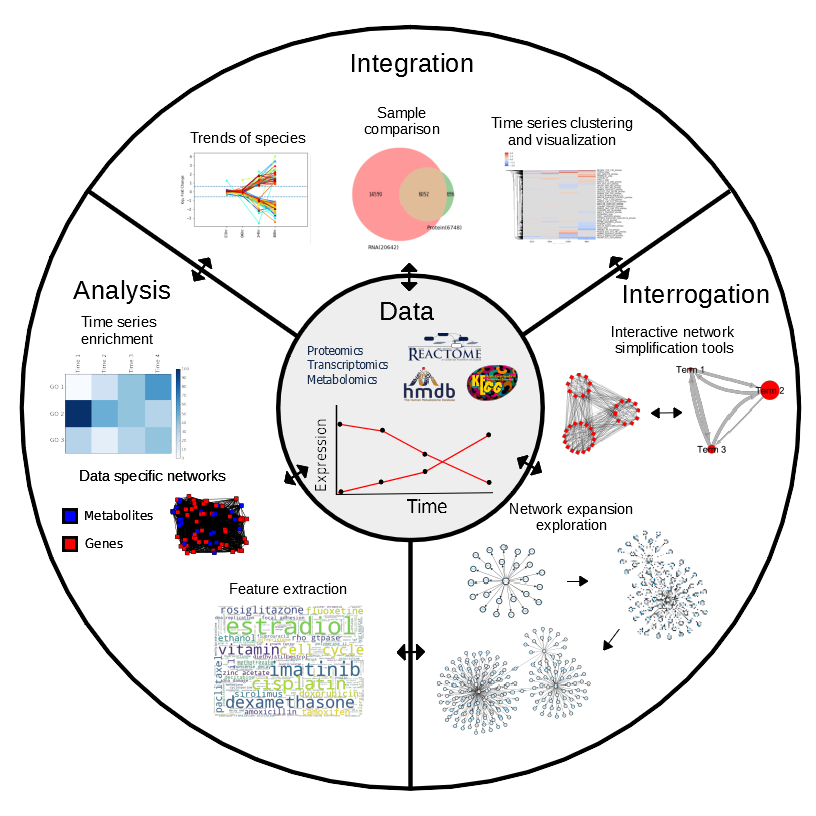

MAGINE documentation
====================
Welcome to MAGINEs documentation. MAGINE was created to help organize and analyze modern high throughput data.
Specifically, we designed it for multi-sample (time series, drug dose, experimental conditions) and multiple omics platform (RNAseq, ph-silac, silac, label-free, metabolomics).
The tools are designed to organize and explore raw data.
- Organize data
- Automate enrichment analysis
- Enable sample series enrichment exploration
- Integrate network and enrichment analysis

MAGINE environment.

MAGINE has four main modules
    - Data
    - Enrichment
    - Networks
    - Tools

Our Data classes are built to organize and facilate exploration for both the raw data and the analysis.
The data class is the central structure that enables this.

Table of contents
-----------------

.. toctree::
   :maxdepth: 2

   installation
   overview
   Tutorial.ipynb
   modules/index

Indices and tables
==================

* :ref:`genindex`
* :ref:`modindex`
* :ref:`search`
