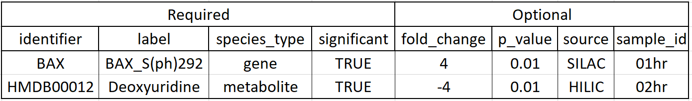

Data
----

This demonstrates the basic format for MAGINEs data.

* Identifier column : use HGNC for gene names and HMDB for metabolites
* label : used to modify the identifier column. For proteins, we tag with any PTM or provide a suffix for the experimental method.
* species_type : gene or metabolite
* significant : Boolean flag to specify if this is a significant species.
* fold_change : scalar value noted fold_change. Expects not log2 but can convert to it later if desired.
* p_value : only needed if you want to use in post analysis.
* source : Used to group data later, we use to tag which experimental platform used
* sample_id : Provide time point or condition. These can be chained together for more complicated systems

Data management
^^^^^^^^^^^^^^^
Tools to process, organize, and query data.
The classes are derived from pandas.DataFrame, meaning everything you can do with pandas you can do with MAGINE.

BaseData is the core DataFrame. We provide functions that are commonly used.
This class is used by both "Sample" and "EnrichmentResult".

.. figure:: ./data_class_design.png
   :scale: 100 %
   :align: center

