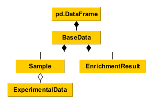

Data management
---------------
Tools to process, organize, and query data.
The classes are derived from pandas.DataFrame, meaning everything you can do with pandas you can do with MAGINE.

BaseData is the core DataFrame. We provide functions that are commonly used.
This class is used by both "Sample" and "EnrichmentResult".

